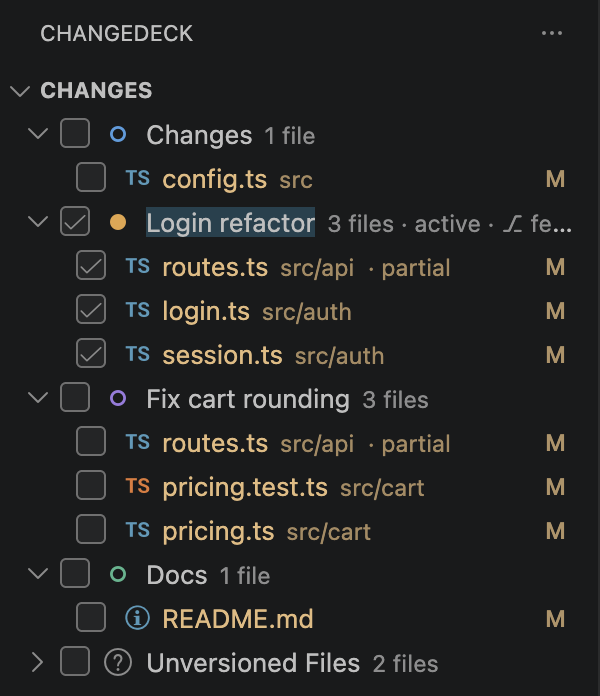
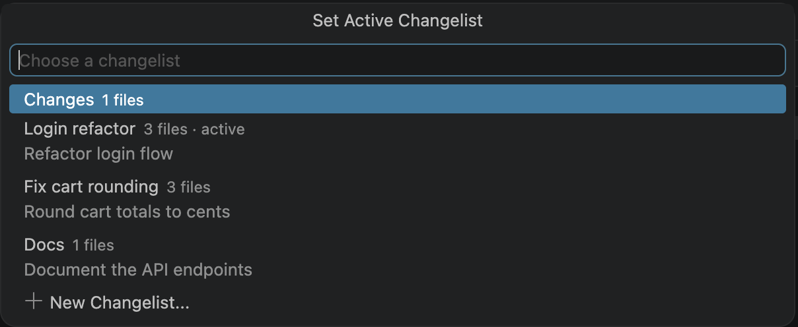
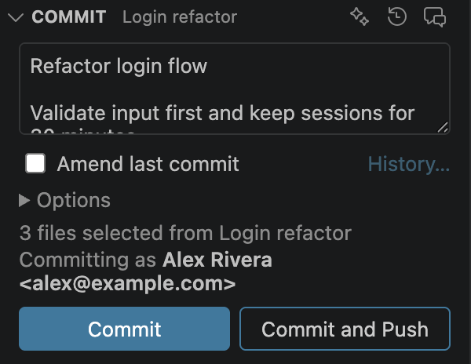
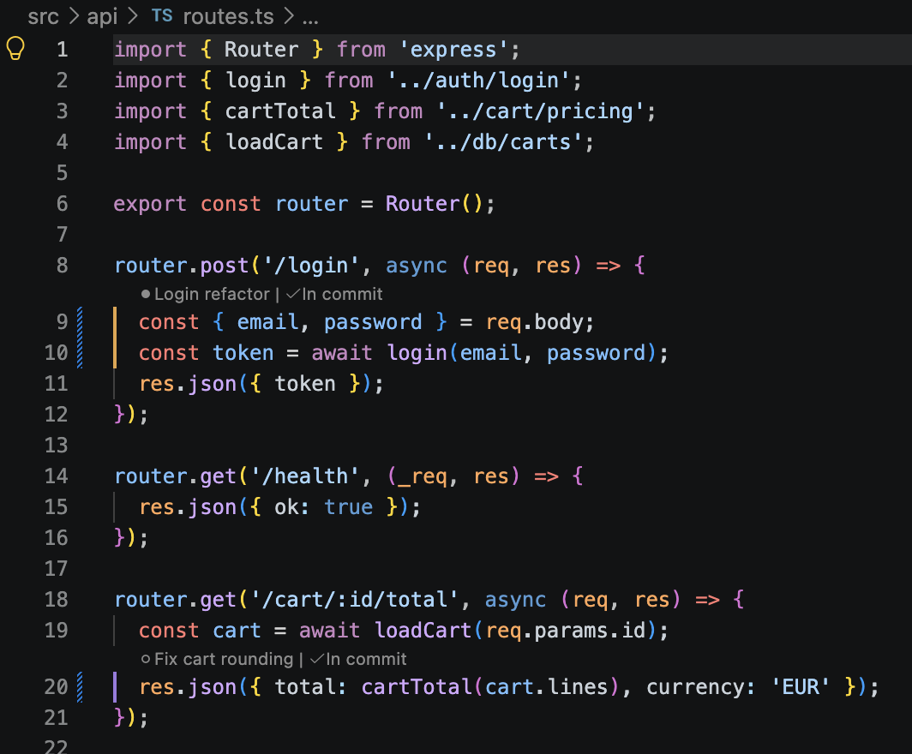
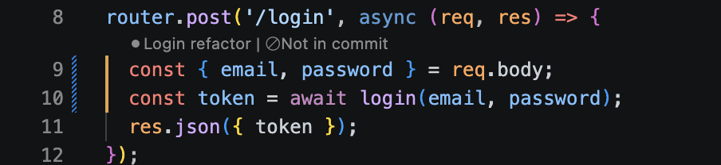
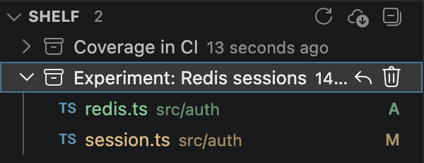
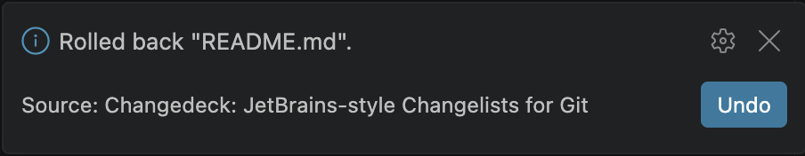

# Changedeck

**JetBrains-style changelists for Git, in Visual Studio Code.**

Changedeck lets you group your uncommitted changes into named changelists, down to single changes inside a file, and commit exactly the ones you tick. Work you are not ready to commit goes on a shelf. If you have used changelists in IntelliJ IDEA, WebStorm or PyCharm, this is that workflow for VS Code.

## What it does

- **Changelists.** Keep unrelated work apart: one list per task, with one *active* list that new changes go to.
- **Commit what you ticked.** Tick files and commit only those, even if other files are staged.
- **Split one file across lists.** Changes are tracked line by line, so two tasks can touch the same file and still be committed separately.
- **Leave a single change out** of a commit without undoing it.
- **Shelf.** Put changes aside and bring them back later, into the same list.
- **Rollback with Undo.** Revert files or a whole list, and undo it if that was a mistake.
- **GitHub Copilot.** Generate the commit message from the ticked changes, review them before committing, or let Copilot suggest how to split a list.

## Quick start

1. Install Changedeck and open a folder that is a Git repository.
2. Click the **Changedeck** icon in the Activity Bar. Your changed files appear in a list called **Changes**.
3. Click **+** in the Changes title bar to create another changelist, for example "Bug fix".
4. Drag files onto it, or right-click a file and choose **Move to Another Changelist…**.
5. Tick the files to commit, write a message in the **Commit** section, and click **Commit**.

The full walkthrough, with a screenshot for each task, is in the **[User Guide](docs/USER_GUIDE.md)**.

## Features

### Organize changes into changelists

Create, rename, reorder and color changelists. The active list is highlighted and shown in the status bar; click it there to switch. A list can be linked to a branch, so it becomes active whenever that branch is checked out.

### Commit exactly what you ticked

The Commit section commits only the ticked files. Each changelist keeps its own draft message, and the line above the buttons shows who the commit will be made as.

Under **Options**: sign-off, skip Git hooks, open the pull request page after pushing, and a different author for one commit. You can also amend the last commit, reuse an earlier message, and run checks before committing (format, organize imports, a lint command).

### One file in several changelists

Edit a file while a different changelist is active and the new change goes to that list. The file then appears in both, marked *partial*. In the editor, every change shows its changelist and a stripe in that list's color. Click the label to move the change to another list.

Commit, roll back, shelve or diff one list's part of the file without touching the other. To hold back a single change, click **In commit** above it:

### Shelf

**Shelve Changes…** saves a list, some files, or one list's part of a file, and takes the changes out of your working files. **Unshelve** brings them back into the changelist they came from, merging with anything you changed in the meantime. Shelves can be exported and imported as patch files.

### Rollback with Undo

Roll back files, folders or a whole changelist. A backup is saved first, so **Undo** restores the files and puts them back in their changelists. **Rollback History…** keeps the last 20.

### GitHub Copilot

With GitHub Copilot signed in:

- **Generate Commit Message** writes the message from exactly the ticked changes, in the style of your recent commits.
- **Review Checked Changes** points out problems before you commit.
- **Suggest Changelists** proposes how to split a list into separate changelists.
- **Suggest Name** names a changelist or a shelf from its content.

## Useful commands

Open the Command Palette (⇧⌘P on macOS, Ctrl+Shift+P on Windows and Linux) and type "Changedeck".

| Command | What it does |
|---|---|
| `Changedeck: New Changelist...` | Creates a changelist |
| `Changedeck: Switch Active Changelist...` | Chooses which list new changes go to |
| `Changedeck: Move to Another Changelist...` | Moves the selected files, or the file in the editor |
| `Changedeck: Move Change to Another Changelist...` | Moves the change under the cursor |
| `Changedeck: Commit` / `Commit and Push` | Commits the ticked files |
| `Changedeck: Generate Commit Message with Copilot` | Writes the commit message |
| `Changedeck: Shelve Changes...` / `Unshelve` | Puts changes aside and brings them back |
| `Changedeck: Rollback...` / `Undo Last Rollback` | Reverts changes and undoes that |
| `Changedeck: Switch Branch...` | Switches branch and takes the linked changelist along |
| `Changedeck: Show Log` | Shows every Git command the extension ran |

## Keyboard shortcuts

| Action | macOS | Windows / Linux | Where |
|---|---|---|---|
| Move change under the cursor to another changelist | ⌃⌥M | Alt+Shift+M | Editor |
| Move selected files to another changelist | ⌘⌥M | Ctrl+Alt+M | Changes panel |
| Rename changelist | F2 | F2 | Changes panel |
| Show diff | ⌘D | Ctrl+D | Changes panel |
| Roll back selection | ⌘⌥Z | Ctrl+Alt+Z | Changes panel |
| Commit / Commit and push | ⌘Enter / ⌘⇧Enter | Ctrl+Enter / Ctrl+Shift+Enter | Commit message box |
| Focus commit message | ⌘⌥K | Ctrl+Alt+Shift+K | Anywhere |
| Switch active changelist | ⌘⌥⇧L | Ctrl+Alt+Shift+L | Anywhere |

## Settings

Search for "Changedeck" in Settings. The setting IDs start with `changelists.`.

| Setting | Default | What it does |
|---|---|---|
| `changelists.viewMode` | `list` | Show files as a flat `list` or a folder `tree` |
| `changelists.partialChangelists` | `true` | Track changes line by line so a file can be split across lists |
| `changelists.codeLens` | `partial` | Show each change's changelist above it: `partial`, `always` or `never` |
| `changelists.editorMarkers` | `partial` | Colored stripe next to each change: `partial`, `always` or `never` |
| `changelists.explorerDecorations` | `true` | Mark files of non-active lists in the Explorer and on tabs |
| `changelists.untrackedFilesGoToActive` | `false` | Put new untracked files straight into the active list |
| `changelists.confirmRollback` | `true` | Ask before rolling back |
| `changelists.deleteEmptyChangelistAfterCommit` | `ask` | `ask`, `always` or `never` |
| `changelists.beforeCommit.format` | `false` | Format the ticked files before committing |
| `changelists.beforeCommit.command` | | Command to run before committing, such as `npm run lint` |
| `changelists.branch.shelveOnSwitch` | `ask` | Shelve a linked list's changes when Switch Branch leaves its branch |
| `changelists.commitMessage.instructions` | | Extra instructions for generated commit messages |

The [User Guide](docs/USER_GUIDE.md) lists the rest.

## Requirements

- Visual Studio Code 1.90 or newer, with the built-in Git extension enabled
- Git 2.26 or newer
- GitHub Copilot, signed in, for the Copilot features only

## Known limitations

- Only modified text files can be split across changelists. Added, deleted, renamed, binary and conflicted files, and files over 4 MB, belong to one list.
- During a merge, cherry-pick or revert, Git only allows committing every changed file at once.
- Committing only part of a file replaces that file's staged version with the committed content (you are asked first). Your working copy is not changed.
- Undo restores the last rollback of the current session, including changelists. Rollback History restores file contents of older ones.

## Questions, issues and source code

- **Source code:** [github.com/RXNova/changedeck](https://github.com/RXNova/changedeck)
- **Report a bug or request a feature:** [github.com/RXNova/changedeck/issues](https://github.com/RXNova/changedeck/issues)
- **User Guide:** [docs/USER_GUIDE.md](docs/USER_GUIDE.md)
- **Release notes:** [CHANGELOG.md](CHANGELOG.md)
- **Building and testing the extension:** [CONTRIBUTING.md](CONTRIBUTING.md)

When reporting a problem, include the output of **Changedeck: Show Log**.

## Data and privacy

Changedeck does not collect telemetry and sends nothing to its author. Changelists are stored in VS Code's workspace storage; shelves and rollback backups are stored in your Git repository. The Copilot features send the diff of the changes involved to GitHub Copilot, and only when you use them.

## License

[MIT](LICENSE)
