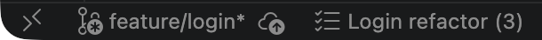
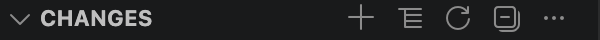
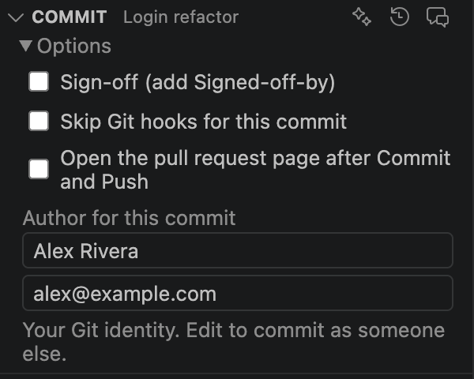
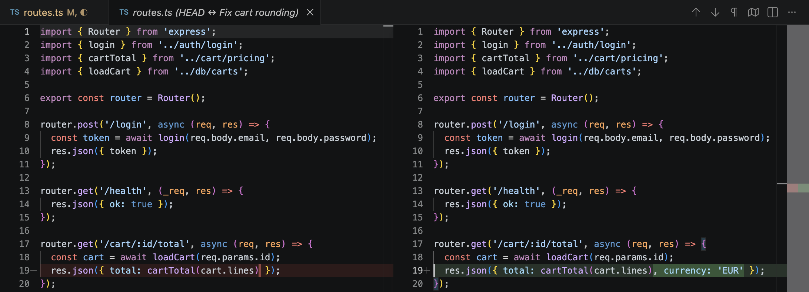
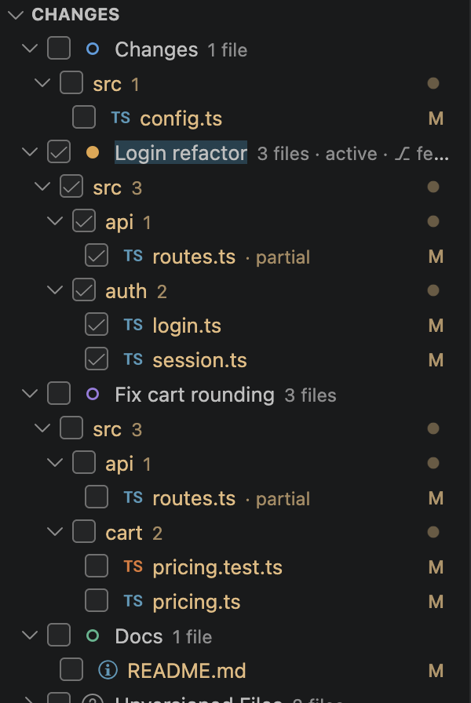
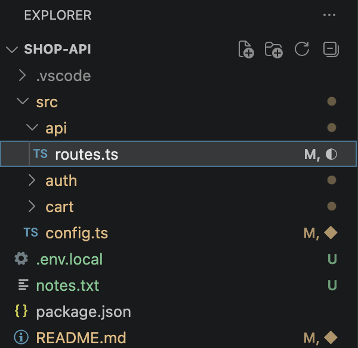

# Changedeck User Guide

Changedeck brings JetBrains-style changelists to VS Code. You group your uncommitted changes into named lists, commit exactly the ones you tick, and put work aside on a shelf.

This guide walks through the everyday tasks. The screenshots show a small sample project.

## Contents

1. [Getting started](#1-getting-started)
2. [The Changes panel](#2-the-changes-panel)
3. [Working with changelists](#3-working-with-changelists)
4. [Moving files between changelists](#4-moving-files-between-changelists)
5. [Committing](#5-committing)
6. [One file in several changelists](#6-one-file-in-several-changelists)
7. [Leaving a single change out of a commit](#7-leaving-a-single-change-out-of-a-commit)
8. [The Shelf](#8-the-shelf)
9. [Rollback and Undo](#9-rollback-and-undo)
10. [Branches](#10-branches)
11. [GitHub Copilot](#11-github-copilot)
12. [Layouts and Explorer markers](#12-layouts-and-explorer-markers)
13. [Keyboard shortcuts](#13-keyboard-shortcuts)
14. [Troubleshooting](#14-troubleshooting)

---

## 1. Getting started

1. Install the extension. From a `.vsix` file: `code --install-extension changedeck-<version>.vsix`, then restart VS Code.
2. Open a folder that is a Git repository.
3. Click the **Changedeck** icon in the Activity Bar (the stack of tiles with a check mark).

The sidebar has three sections: **Changes**, **Commit** and **Shelf**. Shelf starts collapsed; click its header to open it.

Your changed files appear in a list called **Changes**. This is the *active* changelist: every new change lands in the active list. The status bar shows which list is active and how many files it holds. Click it to switch.

---

## 2. The Changes panel

- **Each changelist** has a colored circle. The active one has a filled circle and a highlighted name, and its row says `active`.
- **Checkboxes** decide what the next commit contains. Ticking a list ticks all its files.
- **The letter on the right** is the Git status: `M` modified, `A` added, `D` deleted, `R` renamed, `U` unversioned.
- **`partial`** marks a file whose changes are split across more than one list (see [section 6](#6-one-file-in-several-changelists)).
- **`⎇ branch`** on a list means it is linked to that branch (see [section 10](#10-branches)).
- **Unversioned Files** holds files Git does not track yet.

Click a file to see its diff against the last commit.

The buttons in the panel's title bar:

From left to right: **New Changelist**, **View as Tree / View as List**, **Refresh**, **Collapse All**, and **…** for more actions (Include All, Exclude All, Switch Active Changelist, Switch Branch, Apply Patch, Undo Last Rollback, Rollback History, Suggest Changelists with Copilot, Show Log).

Hovering a row shows quick actions:

| Row | Actions |
|---|---|
| Changelist | **✓** Commit Changelist, **pin** Set Active, **↶** Rollback |
| File | **Open File**, **↶** Rollback, and **+** Add to Git for unversioned files |

Right-click any row for the full menu.

---

## 3. Working with changelists

| To do this | Do this |
|---|---|
| Create a list | Click **+** in the Changes title bar and type a name |
| Make a list active | Hover the list and click the **pin**, or right-click → **Set Active Changelist** |
| Switch the active list from anywhere | Click the list name in the status bar, or press ⌘⌥⇧L (Ctrl+Alt+Shift+L) |
| Rename | Select the list and press **F2**, or right-click → **Rename Changelist…** |
| Edit the description | Right-click → **Edit Description…**. The description is also the list's draft commit message. |
| Reorder | Drag a list onto another list. It moves in front of the one you drop it on. |
| Change the color | Right-click → **Set Color…** |
| Delete | Right-click → **Delete Changelist**. Its files move to the active list; no changes are lost. The active list cannot be deleted. |

Switching the active changelist:

Changelists, their files, ticks and draft messages are saved per workspace and survive restarts.

---

## 4. Moving files between changelists

- **Drag** one or more files (or a folder in tree layout) onto a changelist.
- **Right-click** → **Move to Another Changelist…** and pick a list, or create a new one from the picker. With the Changes panel focused, the shortcut is ⌘⌥M (Ctrl+Alt+M).
- From the **Explorer** or an **editor tab**: right-click → **Move to Another Changelist…**.

Unversioned files stay in **Unversioned Files** until you move them to a list, tick them for a commit, or choose **Add to Git**. To ignore them instead, right-click → **Add to .gitignore**.

---

## 5. Committing

1. **Tick** the files to commit in the Changes panel.
2. **Write the message** in the Commit panel. Each changelist keeps its own draft.
3. Click **Commit**, or **Commit and Push**. In the message box, ⌘Enter (Ctrl+Enter) commits and ⌘⇧Enter (Ctrl+Shift+Enter) commits and pushes.

Only the ticked files are committed, with their current contents. Anything else you staged in Git stays staged and is not included. Ticked unversioned files are added as part of the commit.

Under the message:

- **Amend last commit** adds the ticked files to the previous commit. With nothing ticked, it only changes the message.
- **History…** reuses an earlier commit message.
- The summary line says how many files are selected and from which lists.
- **Committing as** shows the name and email the commit will carry.

**Commit Changelist** (the ✓ on a list) ticks exactly that list's files and moves you to the message box.

The icons in the Commit title bar are **✨ Generate Commit Message with Copilot**, **Commit Message History** and **Review Checked Changes with Copilot** (see [section 11](#11-github-copilot)).

### Options

- **Sign-off** adds a `Signed-off-by` line. This choice is remembered.
- **Skip Git hooks for this commit** bypasses pre-commit and commit-msg hooks once.
- **Open the pull request page after Commit and Push** opens the new pull request page on GitHub, GitLab or Bitbucket.
- **Author for this commit** shows your Git name and email. Edit them to commit as someone else for one commit; **Reset** puts your identity back. If Git has no identity configured, what you type here is used for the commit.

### Before-commit checks

These are off by default. Turn them on in Settings under **Changedeck**:

| Setting | What it does |
|---|---|
| `changelists.beforeCommit.format` | Formats the ticked files |
| `changelists.beforeCommit.organizeImports` | Organizes imports in the ticked files |
| `changelists.beforeCommit.checkProblems` | Asks before committing files that have errors |
| `changelists.beforeCommit.checkTodos` | Asks before committing changes that add TODO or FIXME |
| `changelists.beforeCommit.command` | Runs a command such as `npm run lint`; if it fails, the commit is cancelled |

---

## 6. One file in several changelists

Changedeck tracks changes line by line, so one file can belong to more than one list.

**How a file gets split:** edit a file while a *different* changelist is active. The new change goes to the active list, and the file then appears under both lists, marked `partial`.

In the editor, a split file shows a label above each change and a stripe in that changelist's color:

- A change keeps its list while you keep editing it.
- **Move one change to another list:** click the list name above it, or right-click in the editor → **Move Change to Another Changelist…**, or use the light bulb. With several changes selected, they all move. Shortcut: ⌃⌥M on macOS, Alt+Shift+M on Windows and Linux.
- Each part has its own checkbox in the Changes panel, so you can commit one list's part and leave the other.

Commit, Rollback, Shelve, Create Patch and Show Diff on a split file under a list apply to **that list's changes only**. Here the diff opened under *Fix cart rounding* shows just that list's change, without the login change from the other list:

Only modified text files can be split. Added, deleted, renamed, binary and conflicted files always belong to one list. To turn the feature off, set `changelists.partialChangelists` to `false`.

---

## 7. Leaving a single change out of a commit

Sometimes a file is ready except for one change. Click **In commit** above that change; it becomes **Not in commit**:

The same action is in the editor's right-click menu (**Leave Change Out of Commit** / **Include Change in Commit**) and in the light bulb.

The change stays in your file. It is simply not part of the next commit, and the file's row in the Changes panel notes how many changes are left out. After the commit, it is an ordinary change again.

---

## 8. The Shelf

Shelving saves changes and takes them out of your working files, so you can switch to something else and bring them back later.

| To do this | Do this |
|---|---|
| Shelve a list, files or one list's part of a split file | Right-click → **Shelve Changes…** and give it a name |
| Bring everything back | Hover the shelf and click **↶ Unshelve**. The changes return to the changelist they came from. |
| Bring it back into another list | Right-click → **Unshelve to Changelist…** |
| Bring back some files | Right-click → **Unshelve Files…**, or select files inside the shelf and unshelve them |
| Look at what is shelved | Expand the shelf and click a file to see its diff. **Compare with Current File** diffs it against your working file. |
| Rename or delete | Right-click → **Rename Shelved Changes…** / **Delete Shelved Changes** |
| Move a shelf to another machine | Right-click → **Export as Patch…**; on the other machine, **Import Patch to Shelf…** in the Shelf title bar |

If the files have changed since you shelved them, unshelving merges the shelved changes into them. Changes that overlap get conflict markers, and the shelved copy is kept until it unshelves cleanly.

Shelves are stored inside the Git repository (under `refs/changelists/shelf/`). They do not appear in `git stash list` and they survive restarts and reinstalls.

---

## 9. Rollback and Undo

**Rollback…** (right-click, the **↶** on a row, or ⌘⌥Z / Ctrl+Alt+Z in the Changes panel) reverts files, folders or a whole list to the last commit.

- On a split file under a list, only that list's changes are reverted.
- Added files are removed from Git but kept on disk.
- Unversioned files are moved to the trash.

Every rollback saves a backup first, so it can be undone:

- **Undo** in the notification, or **Changedeck: Undo Last Rollback**, restores the files *and* puts them back in their changelists. It asks first if you edited the files in the meantime.
- **Rollback History…** (in the Changes **…** menu) lists the last 20 backups, so you can restore the files of an older rollback.

---

## 10. Branches

**Link a changelist to a branch:** right-click a list → **Link to Branch…**. The list shows `⎇ branch-name`, and it becomes the active list whenever that branch is checked out, however you switch branches.

**Changedeck: Switch Branch…** goes one step further. When you leave a branch that has a linked list, it can shelve that list's changes and bring them back when you return. The setting `changelists.branch.shelveOnSwitch` controls this: `ask` (default), `always` or `never`.

---

## 11. GitHub Copilot

These features need GitHub Copilot signed in. The first time, VS Code asks whether Changedeck may use Copilot. The diff of the changes involved is sent to Copilot.

| Feature | Where | What it does |
|---|---|---|
| **Generate Commit Message** | ✨ in the Commit title bar | Writes the message from exactly the ticked changes, in the style of your recent commits. The icon becomes a stop button while it writes. |
| **Review Checked Changes** | Speech-bubble icon in the Commit title bar | Opens a short review of what you are about to commit: problems, suggestions and a summary |
| **Suggest Changelists** | Right-click a list, or the Changes **…** menu | Proposes how to split a list's files into separate changelists. You tick the groups you want before anything moves. |
| **Suggest Name** | Right-click a list or a shelf | Suggests a name from the content; you can edit it before accepting |

Settings: `changelists.commitMessage.instructions` adds your own rules (for example "Use Conventional Commits"), and `changelists.commitMessage.modelFamily` picks the model.

---

## 12. Layouts and Explorer markers

**Tree layout.** The second button in the Changes title bar switches between a flat list and a folder tree. In the tree, a folder's checkbox ticks everything beneath it.

**Explorer markers.** Files that are in a changelist other than the active one are marked in the Explorer and on editor tabs: **◆**, or **◐** for a split file. Hover the marker to see the list's name. Turn this off with `changelists.explorerDecorations`.

**Search.** Focus the Changes panel and press ⌥⌘F (Ctrl+Alt+F) to find or filter rows.

---

## 13. Keyboard shortcuts

| Action | macOS | Windows / Linux | Where |
|---|---|---|---|
| Move change under the cursor to another changelist | ⌃⌥M | Alt+Shift+M | Editor |
| Move selected files to another changelist | ⌘⌥M | Ctrl+Alt+M | Changes panel |
| Rename changelist | F2 | F2 | Changes panel |
| Show diff | ⌘D | Ctrl+D | Changes panel |
| Roll back selection | ⌘⌥Z | Ctrl+Alt+Z | Changes panel |
| Commit | ⌘Enter | Ctrl+Enter | Commit message box |
| Commit and push | ⌘⇧Enter | Ctrl+Shift+Enter | Commit message box |
| Focus commit message | ⌘⌥K | Ctrl+Alt+Shift+K | Anywhere |
| Switch active changelist | ⌘⌥⇧L | Ctrl+Alt+Shift+L | Anywhere |

Change any of them in **Keyboard Shortcuts** (search for "Changedeck").

---

## 14. Troubleshooting

| Problem | What to do |
|---|---|
| Something failed and the message is not clear | Run **Changedeck: Show Log** from the Command Palette. It lists every Git command the extension ran and the full error output. |
| "Git has no name and email configured" above the Commit buttons | Open **Options** and enter a name and email, or set them once: `git config --global user.name "Your Name"` and `git config --global user.email "you@example.com"` |
| Menu items appear twice after an update | Quit VS Code completely and reopen it. An older copy of the extension was still loaded. |
| The Shelf section looks empty or missing | It starts collapsed. Click the **Shelf** header at the bottom of the sidebar. |
| Copilot features say no model is available | Sign in to GitHub Copilot in VS Code, then try again |
| A split file went back to a single list | This happens when the previous version of the file is no longer in the repository, or when the file stops being a plain modification (for example it was renamed). Move the changes again. |
| The commit was refused during a merge | During a merge, cherry-pick or revert, Git only allows committing every changed file at once. Tick all of them. |

Settings and command IDs start with `changelists.` (the extension's original name), so search for either "Changedeck" or "changelists" in Settings.
